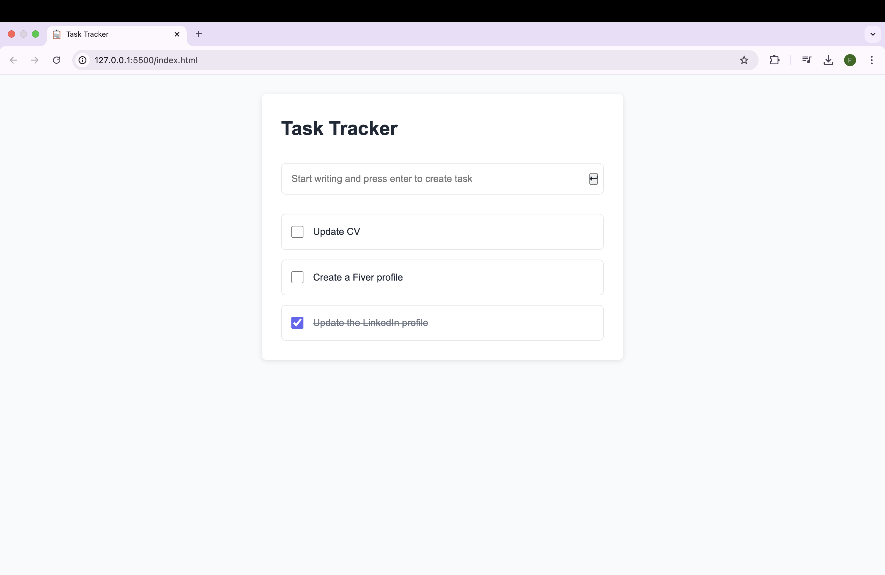

# Task Tracker

An interactive task management application built with vanilla JavaScript. This project is part of the frontend learning path from [roadmap.sh](https://roadmap.sh/frontend).

## Live Demo
[View Demo](https://faizaazam-1.github.io/TaskTracker/)

## Preview

## Features
- Add tasks with Enter key functionality
- Mark tasks as complete/incomplete
- Delete tasks with one click
- Automatic sorting of completed tasks
- Data persistence using localStorage
- 
## Built With
- HTML5
- CSS3
- Vanilla JavaScript

## Project Requirements
This project is created following the requirements from:
[https://roadmap.sh/projects/task-tracker-js](https://roadmap.sh/projects/task-tracker-js)

## Author
Faiza Azam
- GitHub: [@faizaazam-1](https://github.com/faizaazam-1)
